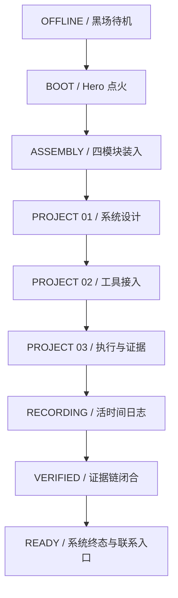

# 首页终版设计：POST-PUNK AGENT ASSEMBLY

状态：**终版方向已确定，可进入实施规划**  
日期：2026-07-21  
产品：Personal Agent Lab 个人首页  
目标用户：招聘经理、高级工程师、Agent 方向合作者  
实现基线：`codex/homepage-refactor` / `73982ba`  
生产代码状态：本文仅定义设计，不代表页面已实现。

## 1. 最终决策

首页采用单一方向：**后朋克机械编舞剧场 / Post-Punk Agent Assembly**。

它不是一个带工业装饰的作品集，也不是科幻控制台。整张页面是一条暴露结构、拒绝粉饰的 Agent 装配线：系统从待机开始，装入上下文、记忆、工具与证据；三个真实项目在轨道工位中被拆解、执行和验证；学习与实践通过连续纸带留下记录；最后所有部件合拢，形成一个可解释、可追溯、可继续工作的系统。

核心结论保持不变：

> 把 Agent 做成真正能工作的系统。

后朋克不是额外的皮肤，而是表达态度的方法：不隐藏接缝，不制造虚假完美，不使用光滑 SaaS 话术；保留过程、限制、失败、安全边界和证据，让系统的可信度来自可见结构。

## 2. 用户在 60 秒内应该得到什么

1. 前 8 秒：明确知道这是一个专注可靠 Agent 系统的人，而不是通用前端作品集。
2. 前 25 秒：看到 Agent 如何通过上下文、工具、边界和证据工作。
3. 前 45 秒：理解三个项目各自解决什么、本人负责什么、当前状态是什么。
4. 前 60 秒：看到学习与实践仍在继续，并能通过真实联系方式进入下一步。

页面必须同时证明两件事：作者有鲜明的视觉判断，也有把复杂系统拆成可靠流程的工程判断。

## 3. 参考来源与借用边界

### 主视觉参考

- 终版机械装配参考：[`output/design-references/homepage-post-punk-mechanical-assembly.png`](output/design-references/homepage-post-punk-mechanical-assembly.png)
- 既有 Agent Lab Hero：`C:\Users\24719\.codex\state\plugins\product-design\assets\homepage-previous-agent-lab-hero.png`
- 既有时间日志：`C:\Users\24719\.codex\state\plugins\product-design\assets\homepage-previous-time-log.png`

### 外部参考

- [Lusion](https://lusion.co/)：借用“核心物体在滚动中持续演出”的空间编舞原则。
- [Obys](https://obys.agency/)：借用激进但有纪律的编辑网格、不对称留白和大型字体节奏。
- [Studio Freight](https://studiofreight.com/)：借用系统示意、图解隐喻与粗粝精确并存的表达。
- [Dogstudio](https://dogstudio.co/)：借用一个主对象贯穿多个场景并保持空间连续性的方式。
- [fromanother](https://www.fromanother.love/)：只借用章节感、镜头节奏与终场意识。

不复制任何参考网站的标志、文案、具体布局、图像或品牌特征。Lusion 的空间、Obys 的网格、Studio Freight 的图解、Dogstudio 的贯穿对象只服务于 Personal Agent Lab 的系统叙事。

## 4. 设计原则

### 4.1 暴露结构

导轨、锁扣、线路、模块编号、约束和证据都可以被看见。视觉复杂度必须对应真实系统关系，不能用无意义零件堆叠制造“高级感”。

### 4.2 橙色代表决定

安全橙只表达五类事情：当前状态、主动路径、机械锁定、警告、确认结果。普通标题、装饰边框和大面积背景不能随意使用橙色。

### 4.3 动作必须改变系统

每一段主要动效都要带来可描述的状态变化，例如“模块装入”“路径接通”“工具调用”“证据写入”“边界锁定”。仅透明度、上下移动或整体缩放不能作为主要叙事动作。

### 4.4 先读懂，再震撼

标题、项目名称、职责、状态和结论永远先于机械纹理被看见。视觉密度主要放在装置区和区块边缘，正文阅读区保持安静。

### 4.5 不伪造完成度

项目仍是占位时，直接显示“待脱敏审查”“内容待补充”“材料待整理”。没有证据链接时不显示二维码、证据编号或完成章；没有确认日期时不生成精确时间码。

## 5. 后朋克视觉语言

### 5.1 不是赛博朋克

本方向禁止霓虹蓝紫、发光玻璃、全息卡片、数字雨、宇宙背景、发光描边和未来城市意象。技术感来自机械逻辑、结构暴露和信息纪律，而不是荧光特效。

### 5.2 材质

- 哑光黑喷漆金属：主机架、模块外壳、滚轴、轨道。
- 暖纸与未漂白纸浆：项目工单、时间日志、验收单。
- 复印机噪点与丝网印刷错位：只用于大字、编号和背景局部。
- 磨损边缘、螺丝、压印和胶带残留：只存在于机械资产，不覆盖正文。
- 安全警示纹：只用于锁定边界、输出口和最终状态。

纹理必须低对比、低频率。正文背后不放高噪点图层。

### 5.3 色彩

沿用现有令牌，不新增另一套主色：

| 角色 | 色值 | 用法 |
| --- | --- | --- |
| 主背景 | `#11100e` | 大部分页面与机械背景 |
| 深背景 | `#090907` | 舞台、轨道内部、终场 |
| 暖纸 | `#f0eadf` | 大标题、工单、时间纸带 |
| 纸张次级 | `#d8d0c3` | 次级文字和未激活纸面 |
| 安全橙 | `#d75a32` | Agent 核心、信号、锁定和确认 |
| 深墨 | `#14120f` | 纸面文字与反色内容 |

整体面积建议约为黑色 72%、暖纸 20%、橙色 6%、其他灰阶 2%。橙色宁少勿泛滥。

### 5.4 字体

- 展示层：现有中文无衬线字体栈，使用 800–900 重量、紧字距和极紧行高。
- 正文层：Manrope Variable 与中文系统无衬线，保持正常字宽与舒适行距。
- 系统层：JetBrains Mono Variable，用于模块 ID、时间、状态、坐标和动作词。
- 不额外引入装饰字体。后朋克感由排版结构、印刷处理和文案语气产生。

大型标题允许局部复印错位或一层极轻的橙色套印偏移；正文、按钮和表格禁止这种处理。

### 5.5 网格

- `≥ 1280px`：16 列，左右安全边距 32–48px，中央保留一条贯穿页面的装配轴。
- `768–1279px`：12 列，减少机械外围信息，内容与主装置上下或 5/7 分栏。
- `< 768px`：4 列，取消横向生产线，改为纵向工位序列。
- 所有主要内容必须落在安全区内。装饰可以越界，但标题、按钮、模块名称和主视觉核心不能被裁切。

圆角保持 0–2px。禁止胶囊按钮和大圆角卡片。

## 6. 页面叙事

页面只保留五个主要章节：系统栏、Hero、项目舞台、时间日志、Finale。能力标签被装入 Hero 和项目工位，不再单独做通用能力卡片；最新内容不占据独立首页区块，可通过时间日志或导航进入。

## 7. 固定系统栏

高度控制在 48–56px，背景为接近不透明的深黑，底部一条细边界线。它不是普通导航条，而是整台系统的状态轨。

左侧：`AGENT SYSTEMS LAB`。  
中间：当前章节坐标，如 `SYS_MODE: ASSEMBLY`。  
右侧：状态，如 `STATUS: STANDBY / RUNNING / VERIFIED`，以及项目、日志、联系入口。

滚动只更新文字和一条短橙色状态块，不移动整条导航。键盘焦点使用清晰的暖纸或橙色外框。移动端保留品牌、当前状态和菜单，隐藏测量刻度。

## 8. Hero：BOOT SEQUENCE

### 8.1 构图

桌面首屏不是两个独立的左右栏，而是一张被一条装配轴连接的整体构图。

- 左侧 5/16：巨型标题占据约 70% 高度，分为 `把 Agent / 做成真正 / 能工作的 / 系统。`
- 中央 1/16：装配轴、坐标、模块编号与少量动作词穿过标题边界。
- 右侧 10/16：十字形 Agent 核心装配台，中央是橙色核心，上方 Context、左侧 Memory、右侧 Tools、下方 Evidence。
- 标题下只保留一段立场说明和一个进入项目的主入口，不展示第二套冗余按钮组。
- 底部逻辑条显示：`CONTEXT + MEMORY + TOOLS + EVIDENCE → RELIABLE EXECUTION`。

主机械装置使用真实、独立分层的视觉资产；标题、模块名称、状态和说明保持 HTML 文本。不能把整个 Hero 做成一张大图，也不能用普通方框近似重型机械装置。

### 8.2 滚动长度

桌面建议 `180svh`，内部视口 sticky。移动端取消长时间固定，改为短进入动画加静态完成态。

### 8.3 动效状态

| 进度 | 状态 | 画面行为 |
| --- | --- | --- |
| 0–8% | OFFLINE | 深黑画面中只有系统栏和微弱坐标；无持续闪烁 |
| 8–22% | SELF CHECK | 外框、刻度和装配轴分段出现；标题暖白部分硬切进入 |
| 22–48% | ASSEMBLING | 四个模块沿真实导轨进入，机械臂与接口对齐 |
| 48–64% | LOCKING | 锁扣依次闭合，模块 ID 和职责文字确认 |
| 64–82% | START PULSE | 橙色信号按 Context → Memory → Tools → Evidence → Agent 顺序传播 |
| 82–100% | RUNNING | Agent 核心稳定点亮，标题橙色结论锁定，项目入口开启 |

首屏只允许一个低频待机动作：Agent 核心每 3.6–4.2 秒进行一次很轻的呼吸信号。模块装配完成后停止位移，不持续漂浮。

### 8.4 交互

悬停或聚焦 Context、Memory、Tools、Evidence 标签时，只高亮对应机械模块和连接路径，并显示一句真实职责说明。交互不是完成理解所必需；触屏和键盘用户可以直接阅读完整模块列表。

## 9. Project Stage：三工位项目生产线

### 9.1 结构

桌面建议 `380svh`，舞台固定在一个视口内。三幕共享同一套机架、轨道和 Agent 核心，避免三个互不相关的全屏页面轮流淡入。

舞台分为：

- 左侧状态轨 2/16：编号、项目类型、项目状态。
- 中央内容 5/16：项目标题、摘要、个人职责、标签和入口。
- 右侧机械舞台 9/16：当前项目的主视觉和内部系统动作。

每幕必须完整展示项目标题、角色、状态、标签和一个主视觉。项目素材不足时使用明确的“材料待整理”状态，不使用无关库存图。

### 9.2 三幕语义

#### 工位 01：PLAN / 系统设计

对应第一个真实项目。视觉从散乱的需求纸片、上下文模块与边界板开始；滚动后，目标、约束、接口和责任边界被夹具固定到统一框架中。最后形成一张可读的系统结构图或真实项目截图。

主要动作：归类、对齐、夹紧、建立边界。  
必须回答：问题是什么、本人负责什么、哪些内容不能公开。

#### 工位 02：BUILD / 工具接入

第一幕形成的核心模块沿轨道进入第二工位。工具接口从侧面接入，能力和权限被逐项校验；真实工具调用、代码、节点图或原型画面在媒体舱中展开。

主要动作：插接、校验、开闸、调用、回写。  
必须回答：用了什么方法、做了哪些关键决策、如何处理安全边界。

#### 工位 03：RUN / 执行与证据

已接入工具的系统进入运行舱。任务信号穿过执行、验证、记录和反馈模块；真实结果或脱敏后的证据在输出端形成包，并显示明确状态。

主要动作：执行、比对、盖章、封装、输出。  
必须回答：目前得到了什么、如何验证、还有什么限制。

三幕是视觉动词，不替代真实项目名称。当前数据仍是占位时，保留原有占位标题与审查状态。

### 9.3 场景进度

| 项目舞台进度 | 行为 |
| --- | --- |
| 0–10% | 生产线启动，空工位和轨道进入 |
| 10–29% | 工位 01 内部完成系统设计动作 |
| 29–36% | 产物沿轨道从 01 转移至 02 |
| 36–57% | 工位 02 完成工具接入和校验 |
| 57–64% | 产物从 02 转移至 03，证据记录器开始待机 |
| 64–87% | 工位 03 执行、验证并生成证据包 |
| 87–100% | 输出端开启，证据包进入时间日志 |

项目切换不能以 `opacity + y + scale` 为主。透明度只能辅助遮罩；真正的连续性来自同一实体在轨道上移动、拆开、重组和锁定。

### 9.4 防裁切规则

- 在 `1440×900` 和 `1440×1024` 下，右侧装置的可见边界必须与视口右侧保持至少 32px 安全距离。
- 项目标题最大宽度根据实际字数限制，不允许侵入主机械资产的核心区域。
- 机械资产采用 contain 逻辑和可测量的固定安全框，不使用无法预测的超宽绝对定位。
- 窄桌面优先减少外围机架和注释，不缩小正文到不可读，也不裁掉第三幕主视觉。

## 10. Live Time Log：卷轴式证据记录

### 10.1 构图

时间日志是整页唯一大面积暖纸区间，承担从黑色项目舞台到黑色终场的呼吸与证据转换。

- 左右是哑光金属滚轴，中央是一条横向穿孔纸带。
- 顶部中央固定 `EVIDENCE SCANNER`。
- 每条记录包含：真实时间或阶段、事件标题、组织/来源、摘要、状态、可用证据入口。
- 当前事件使用橙色标题与 `IN PROGRESS`；已完成事件使用深墨确认章；待确认事件使用轮廓章。
- 没有真实链接时不显示二维码；没有精确日期时只显示“现在”“待填写”等真实信息。

### 10.2 动效

桌面建议 `170svh`。纸带随滚动而移动，而扫描器固定在中心。每条记录进入扫描区时依次发生：定位、扫描、状态确认、写入证据链。完成后记录继续离开中心，但仍可阅读。

波形只反映当前扫描动作，不做持续随机跳动。盖章只发生一次，不循环。时间推进与用户滚动一一对应，不做自动传送带。

当前只有两条真实/占位经历时就展示两条，不复制出虚假条目填满纸带。纸带长度随数据数量自适应。

## 11. Finale：SYSTEM STABLE

### 11.1 构图

结尾不再使用另一组占满屏幕的 Hero 式大标题。它是一个真正的系统终态：

- 左侧 4/16：三行短结论——`系统稳定。/ 证据闭环。/ 可持续协作。`
- 中央 8/16：Hero 中的 Agent 装配台重新出现，但四个模块已经锁定，机械臂处于承载状态。
- 右侧 4/16：`SYSTEM INFO` 与下一步入口，列出真实模块、内容边界、证据状态和联系方式。
- 底部：Email、GitHub、WeChat 三个真实入口以及返回顶部。

不显示虚构的 100% 指标。若内容尚未补全，状态使用 `STRUCTURE READY / CONTENT IN REVIEW`，不能宣称全部验证完成。

### 11.2 收束动效

1. 时间日志的最后一条有效记录以证据包形式进入中央系统。
2. Context、Memory、Tools、Evidence 四个模块向中央收紧一个机械单位。
3. 橙色锁扣逐项闭合，连接线从活动状态变为稳定状态。
4. 系统状态根据真实内容切换为 `STRUCTURE READY` 或 `SYSTEM READY`。
5. 联系入口点亮；所有背景机械运动停止，页面进入安静完成态。

Finale 的高潮来自“混乱被组织成稳定系统”，而不是更大的字、更亮的光或更多持续动画。

## 12. 动效系统

### 12.1 状态机

全页共享同一状态语法：

`OFFLINE → SELF CHECK → ASSEMBLING → RUNNING → RECORDING → VERIFIED → READY`

系统栏、橙色信号、模块状态和章节标题都从这个状态机读取，避免每个区块自说自话。

### 12.2 允许的动作

- 沿导轨平移：表示数据、部件或产物转移。
- 机械锁定：表示确认、校验或边界建立。
- 面板展开：表示揭示内部方法或证据。
- 脉冲传播：表示执行路径，不表示装饰活跃度。
- 纸带推进：表示时间和持续实践。
- 收紧与停机：表示系统达到稳定结论。

禁止无来源漂浮、弹跳卡片、随机旋转、背景粒子、无意义视差、快速频闪和永不停止的装饰循环。

### 12.3 时间与缓动

- 微交互：120–180ms。
- 锁扣与状态确认：220–360ms。
- 模块装入：600–900ms。
- 大型场景重组：900–1200ms。
- 默认缓动沿用 `cubic-bezier(0.22, 1, 0.36, 1)`。
- Scroll-scrub 由滚动位置直接驱动，使用轻量 spring 平滑，不引入滚轮劫持。

主要机械动作完成后必须停在清晰终态。全页同时持续运动的元素不超过两个。

### 12.4 跨章节接力

- Hero 的 Agent 核心以相同尺寸比例进入项目舞台。
- 项目舞台生成的证据包成为时间日志第一条可见输入。
- 时间日志最后的有效证据进入 Finale。
- 相同实体使用一致颜色、编号和运动方向，用户无需猜测它是否还是同一个系统。

## 13. 响应式策略

### 桌面 `≥ 1280px`

完整保留 Hero 装配、三幕 pinned 项目舞台、纸带扫描和 Finale 汇聚。机械外围信息最完整。

### 小桌面与平板 `768–1279px`

- Hero 从 5/11 比例改为上下错位布局，装置仍完整可见。
- 项目舞台缩短固定距离，每幕的文字先出现，主视觉随后在下方完成动作。
- 时间日志仍保留扫描器，但滚轴简化。
- 删除约 40% 的装饰刻度、编号和小型机械附件。

### 手机 `< 768px`

- 不使用长 pinned 场景，也不模拟横向生产线。
- Hero 先读标题，再显示已装配完成的 Agent 装置；只播放一次 600–900ms 的短点火。
- 三个项目作为垂直工位依次阅读，每个工位内部只保留一个明确动作和一张真实主图。
- 时间日志变为纵向穿孔纸条，当前记录以橙色侧线标记。
- Finale 直接显示锁定完成态，联系入口保持原生、清晰、易点击。

所有断点都必须避免横向滚动。

## 14. Reduced Motion 与无障碍

- `prefers-reduced-motion: reduce` 时取消 sticky 长舞台、轨道移动、纸带推进、呼吸和盖章动作。
- Hero 直接显示已装配完成的结构；项目按正常文档流排列；时间日志变为静态列表；Finale 显示真实最终状态。
- 动画不会成为读取项目关系的唯一方法，关键顺序同时通过编号、箭头文本和 DOM 顺序表达。
- 状态不能只依赖橙色，必须同时有中文或英文文字。
- 装饰机械、噪点、刻度和坐标从无障碍树隐藏。
- 所有项目入口、导航和联系方式支持键盘；焦点样式不得被机械边框吞没。
- 不使用超过 3Hz 的闪烁，不在正文后持续移动高对比背景。
- 正文对比度以 WCAG AA 为最低线；暖纸上的深墨和黑底上的暖纸优先。

## 15. 内容规则

首页只展示已经确认的事实。终版上线前需要补齐或确认：

- 三个项目的真实名称或可公开名称。
- 项目类型、本人职责、当前状态、关键方法与结果边界。
- 可公开的真实截图、架构图、日志、代码或证据链接。
- 经历的真实时间、组织公开方式和摘要。
- Email、GitHub、WeChat 等联系方式。

在内容未确认前，沿用现有占位文本，不用漂亮但虚假的内容替换。受限项目可以证明方法与边界，不必暴露业务秘密。

## 16. 资产规范

### 必需资产

1. Hero/FInale 共用的 Agent 装配台主资产，包含中央核心、四模块、机架和锁扣的可分层版本。
2. 三个项目工位的真实媒体内容，每幕至少一个主视觉。
3. 时间日志滚轴、扫描器和纸带材质。
4. 一张低对比复印噪点纹理和一张哑光金属纹理。
5. 必要的真实图标，优先使用项目现有图标库或统一开源图标库。

### 资产原则

- 机械装置使用真实的艺术指导资产或分层渲染，不用 div/CSS 方块临摹终版主视觉。
- 文本、按钮、状态、项目资料和联系方式必须保留为 HTML。
- 不把整屏参考图当作网页背景。
- 桌面资产提供 2x 清晰度，优先 AVIF/WebP；透明层控制数量，避免首屏解码过重。
- 项目真实截图保持原始比例，使用安全框适配，不强行拉伸或裁掉关键 UI。

## 17. 实现结构建议

在 `codex/homepage-refactor` 基线上拆分为：

- `HeroSection`：Hero 容器与滚动状态。
- `AgentAssembly`：可在 Hero 与 Finale 复用的装配台。
- `FeaturedProjectsSection`：舞台状态机与三项目调度。
- `ProjectWorkstation`：共用工位骨架。
- 三个项目专属 visual scene：各自拥有不同内部动作，不共享一个泛化淡入模板。
- `LiveTimeLog`：纸带、扫描器和事件数据。
- `SystemFinale`：证据汇入、锁定状态与联系入口。
- 共享 motion tokens：缓动、spring、断点与 reduced-motion 结果。

继续使用现有 Next.js 16、React 19 和 Motion。主滚动逻辑由原生 sticky 与 Motion scroll progress 驱动，不引入整页滚轮劫持。开始编码前按 `AGENTS.md` 阅读本地 Next.js 版本文档。

## 18. 性能边界

- 首屏关键机械资产应分层加载，但不可让核心装置在标题出现很久后才突然跳入。
- 非首屏项目媒体延迟加载；即将进入项目舞台时再预取。
- 纹理以小尺寸可平铺资源为主，禁止多张全屏 4K 噪点图。
- Scroll 过程中优先使用 transform、opacity 和 clip 等可控属性；避免对大面积模糊和阴影持续动画。
- 停止不可见区块的动画和计时器。
- 在中端移动设备上以稳定阅读优先，允许完全降级为静态构图。

## 19. QA 与验收

### 必测视口

- `1440×900`
- `1440×1024`
- `1280×800`
- `1024×768`
- `768×1024`
- `390×844`
- `375×812`

### 终版通过条件

- 第一屏在不读长文的情况下也像一次清晰的系统点火。
- 标题和 Agent 装置属于同一构图，不再像安静的两栏页面。
- 三个项目的内部视觉分别发生结构性变化，不能只靠场景淡入、上下位移和缩放。
- 项目标题、职责、状态和主视觉在 1440px 宽度完整可见。
- 时间日志明确表现“事件正在被记录”，不是普通履历表。
- Finale 将前文实体和证据收束为稳定状态，不重复 Hero 大字公式。
- 无动画时所有信息仍完整、按顺序、可导航。
- 桌面与移动端无横向溢出。
- 所有公开内容真实，所有占位与受限边界明确。
- lint、build 通过，并使用浏览器逐段验证正常动效与 reduced-motion。

## 20. 明确不做

- 不增加玻璃拟态、圆角 SaaS 卡片、霓虹赛博朋克、装饰球体和随机粒子。
- 不把能力、项目和内容重新排成泛化三列卡片。
- 不使用假的百分比、企业、奖项、项目结果、时间戳、二维码或证据编号。
- 不用整屏视频掩盖缺乏项目素材的问题。
- 不为了“更炫”牺牲可读性、键盘导航、移动端和 reduced-motion。
- 不把外部参考网站的布局或品牌直接拼接进来。

## 21. 实施优先级

### P0：决定成败

Hero 点火、三项目内部编舞、卷轴时间日志、Finale 汇聚、1440px 不裁切、reduced-motion。

### P1：增强完成度

系统栏状态同步、项目间实体接力、材质与印刷细节、键盘聚焦联动。

### P2：可延后

高级指针检查器、声音反馈、WebGL、复杂 3D 实时光照。终版不依赖这些能力成立。

## 22. 最终判断

这套首页的记忆点不是“黑橙工业风”，而是一个完整因果链：

> 模块被装入，项目被运行，时间留下记录，证据进入边界，系统最终稳定。

视觉、文案、动效和信息结构都必须服务于这条因果链。任何无法解释系统状态变化的装饰都应删除。
